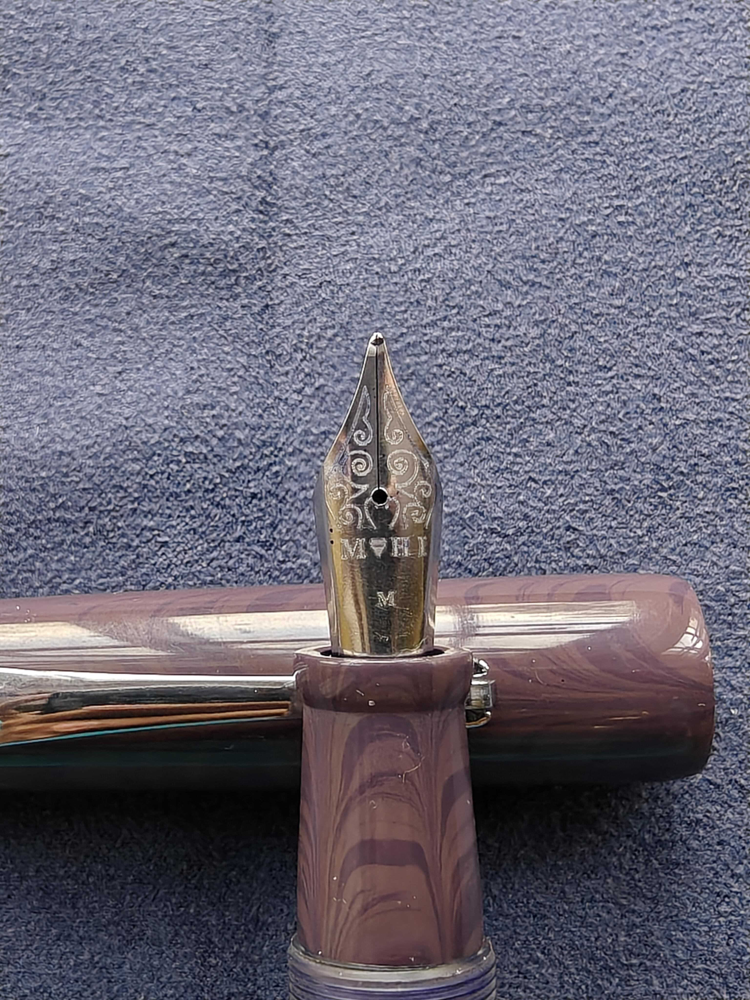
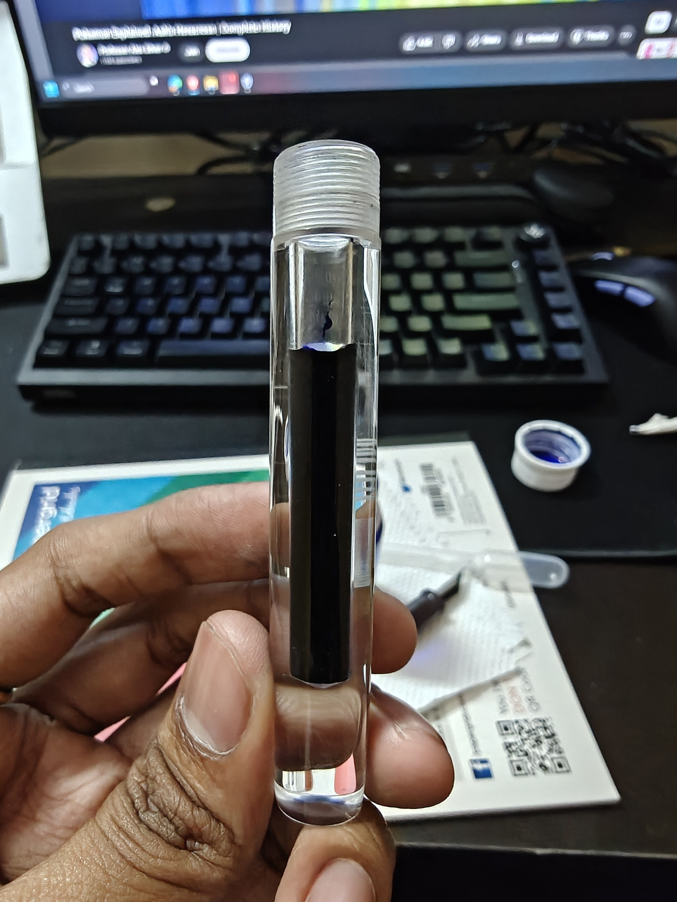
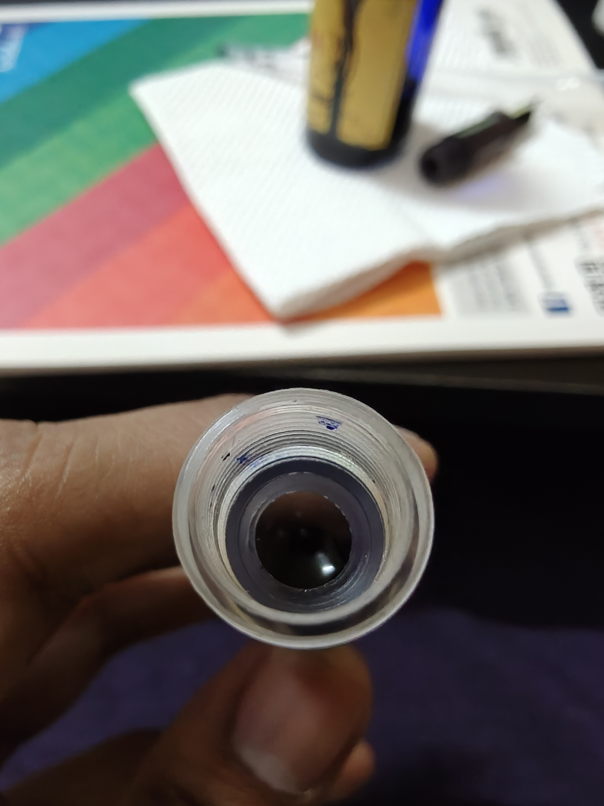
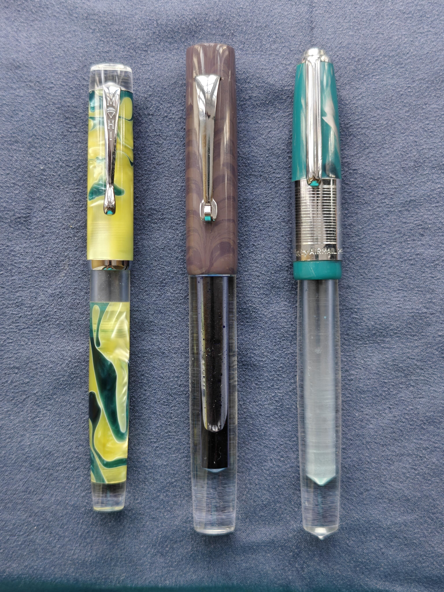
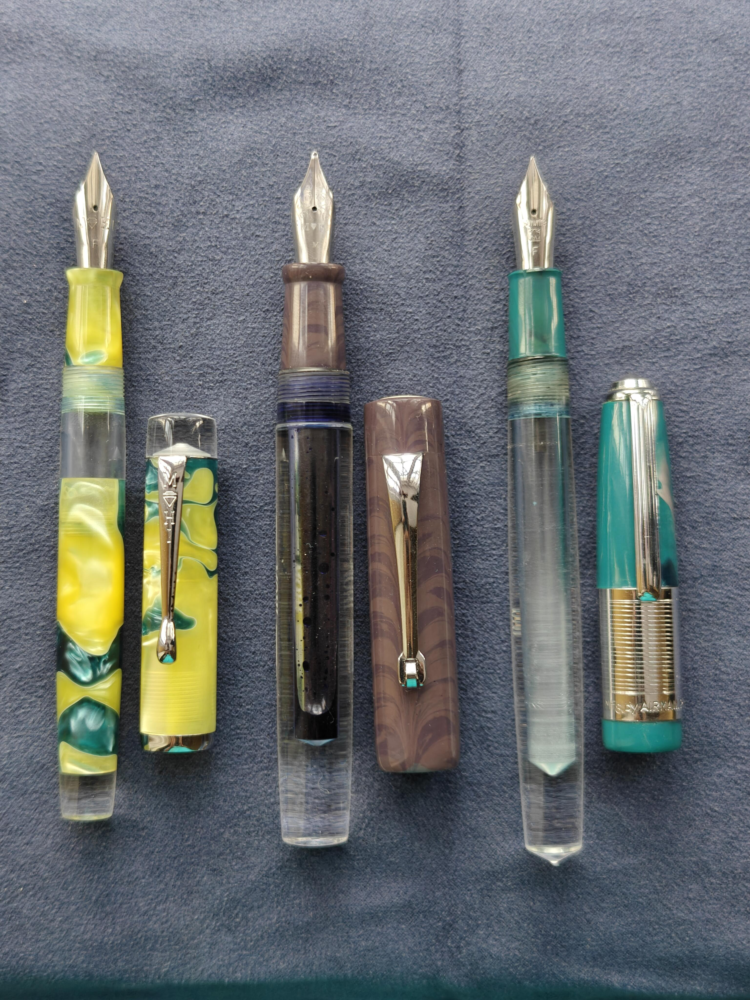
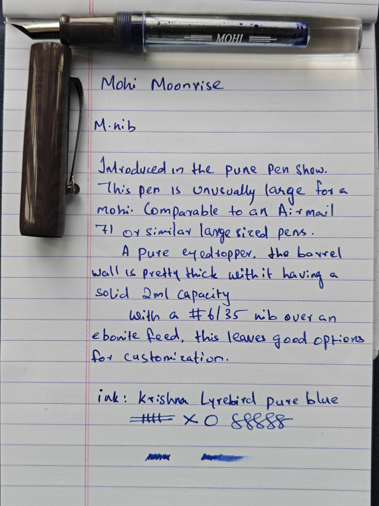

# Mohi Moonrise: A Good Pen into Mohi's Premium Portfolio

Mohi... or daimond, as it is known in several Indian languages is a familiar name in the fountain pen space... Known for providing high quality fountain pens at a reasonable price. these pens always punch way above their weight. Their most famous models, the Harmony and Tanishq are known for giving great acrylic patterns with great nibs at an affordable price. Well, it seems that this Aurangabad based pen maker is starting to go for the premium market as well. The first signs of this came last year with the release of the Mohi Alex. A chased ebonite model with a 3-in-1 filling system(Cartridge, converter and eyedropper) with an ebonite feed. But at 7000 rupees, it was way out of my league... The pen is solidly built, but for 7k, you can easily get vintage pens like the Parker 51 with gold nibs. And you'll still have around 1-1.5k left to buy a Mohi Tanishq. 

The pen still saw some sales, but I still think they have not sold that much. So this year... they released 3 new models for the Pune pen show. The Moonrise an acrylic and ebonite eyedropper pen, the Octa a well designed pen with a Jowo #5 nib, and the Monsoon, a sub 1000 rupee pen to remind us that Mohi still has options for the budget conscious. 

I bought my Moonrise from Anant Pathak right after the Pune pen show concluded, and paid around Rupees 2700 INR. Though it was still on the launch promo. The actual MRP is 3000 INR. And I can say, for the price, while I can't say it is a good value compared to other Mohis, it is definitely a great pen and the price is reasonable. So without any further ado, let's get into the review.

!!! abstract "TLDR"
    If you want a solid built, well finished, and great looking eyedropper pen on the larger side, then this is a great option to consider. The price is a bit steep for a Mohi, but the build and design say for themselves. It's not a blind buy like previous Mohis, but it is an option worth considering.

## A Great Demo

Coming to the design aspect, this is a handsome looking pen. With the purple ebonite, the roller clip, and the thick acrylic barrel, this is one great looking pen.

Uncapped, the pen has a good looking ebonite section and the standard Mohi No.6/35 nib fit on top of an ebonite feed. There are fine and medium options available. I opted for the medium: 

Coming to the barrel, it is finished quire nicely and the walls are surprisingly thick... in fact, I believe that the barrel walls are the thickest among all my pens... And on closer inspection, it seems that the barrel has a step milled inside for accommodating the section tenon, while keeping the barrel walls thick:

As for measurements and size comparison:

The dimensions are:

- Length
	- Capped: 152.4mm
	- Uncapped: 135.1mm
- Thickness of the barrel: 15.1 at the thickest and 13.1 at the thinnest
- Barrel wall thickness:
	- Before step: 1.9mm
	- After step: 4.2mm
- Cap diameter: 16.6mm 
- Section dimension: 12.8mm tapering to 11mm and flaring out to 12.4mm over a length of 20.4mm

As for size comparisons, I was travelling so I didn't have many pens to compare to, but here is a comparison between the pens I did bring:

From Left to Right:

- Mohi Harmony
- Mohi Moonrise
- Airmail 71JT

Sadly, I didn't bring my Woodex 39 or my Moonman Q2 for comparing against my largest and smallest pen, but suffice to say it is a pretty comfortable pen to hold. It posts barely and does so securely, but I imagine you'll be fine without posting unless you have Shrek hands.

## The Writing: Uncharacteristic for a Mohi to Say The Least

I've owned around 6 Mohi pens before buying the Moonrise, and I've had pretty good experiences so far. This on the other hand, is one of the worst nibs I've ever had. I think Mohi has changed their suppliers while making the Moonrise, and I might have gotten a defective one as my friends who got the pen have said their nibs was good. However I can only say my experience and suffice to say that it was a bad one. The pen was scratchy along one end, and the nib suffered from serious canyoning issues. The good thing was that I managed to tune it up to make it write good, but it required some serious tinkering to get it to write well.

Apologies for the brief writing sample compared to the previous review because, again, I was on a trip... So I carried my notepad with me, and I used it to make this review. After Tuning it up, it now writes as smooth as my other Mohis. 

For anyone else planning to buy this pen, I'd say Mohi might have ironed out the issues with the nib, but I'd still air on the side of caution. What I can say that the flow is wet and writes well. The pen takes approximately 2ml, which is small for a pen this size, but more than enough for most folks. 

## Final Verdict: A Step in The Direction... Though What Direction I Don't Know

This pen shows a shift in Mohi's positioning as a fountain pen company. While they're mostly known for their budget offerings, this, the Octa and the Alex clearly show that they're trying to go more upmarket in their positioning. And while I do find that to be a valid move, I just feel like for 3000 rupees this pen while being a good, well finished pen, does not scream great value as compared to their more budget offerings... If this pen came with a nib unit instead of a friction fit setup, I'd say it to be a great value for money pen.

Don't get me wrong, this is a great pen, it's just that with the price and the nib I got, I find it hard to recommend compared to other Mohis. But if you like a good eyedropper pen that looks great and is a solid carry, then the Moonrise should definitely be in your radar.
