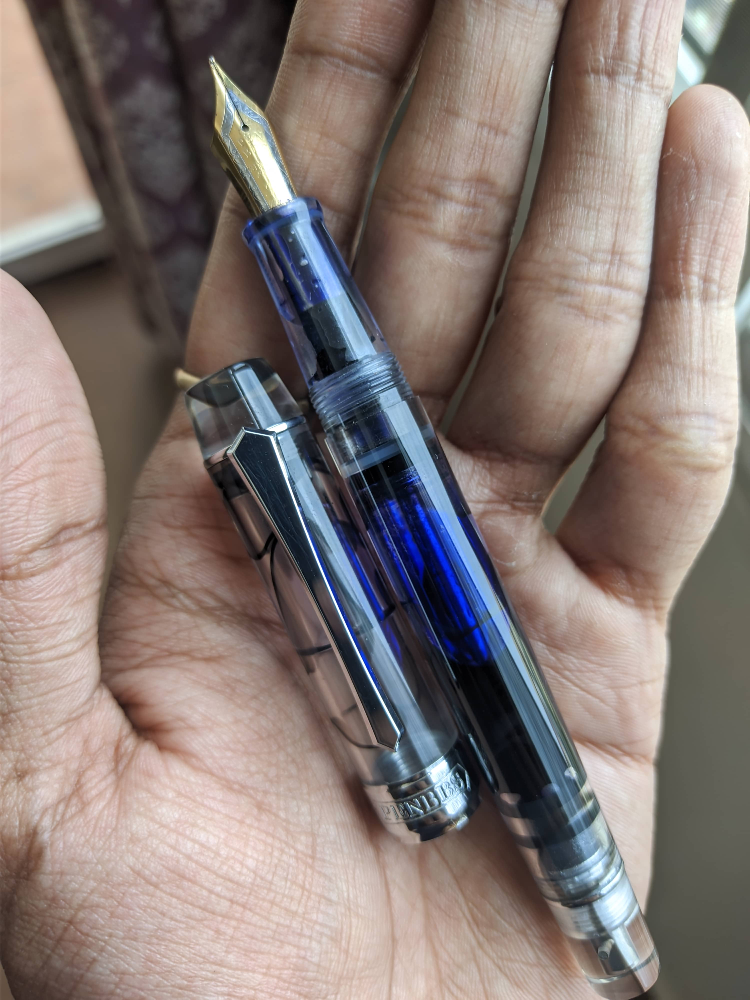
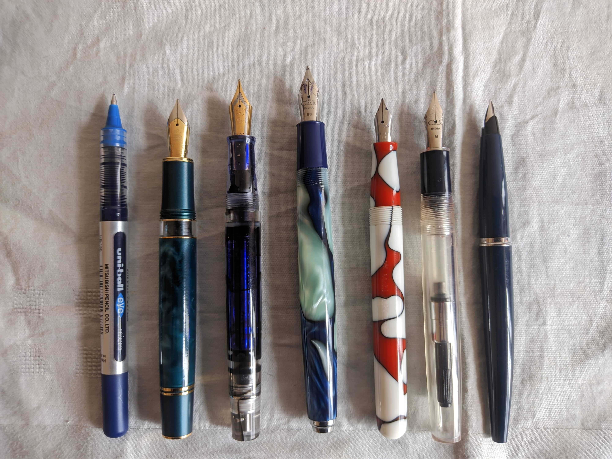
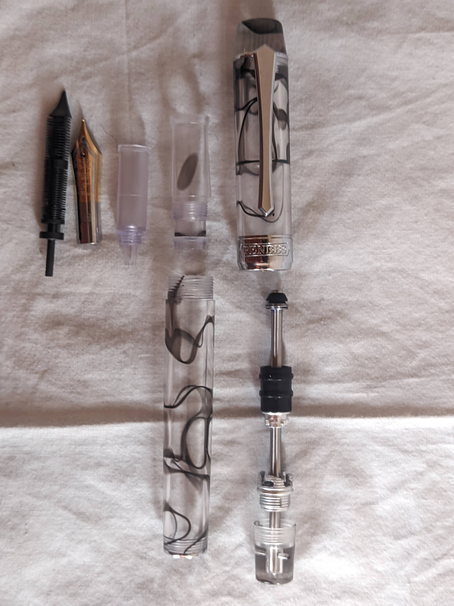
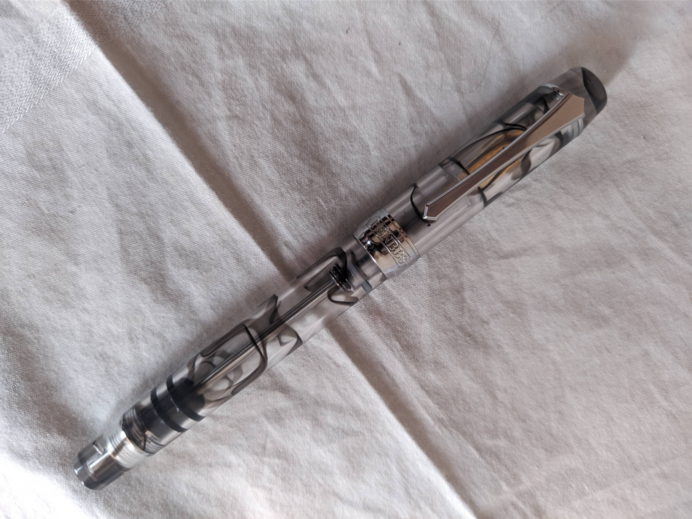
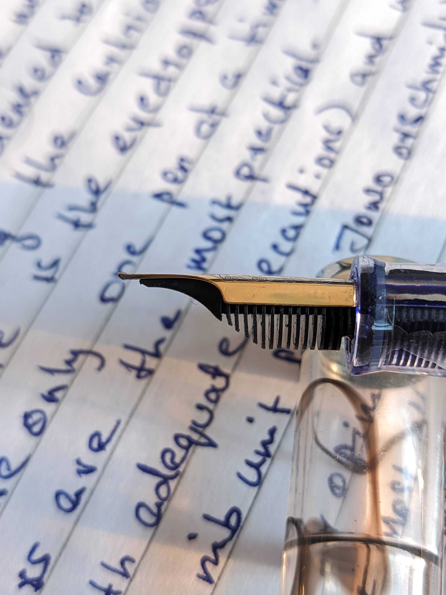

# PenBBS 355... More Than a Conid Knockoff

One of the most fascinating aspects of a fountain pen is the way you fill it with ink. You have the most basic eyedropper fill, to the popular kid in class, the cartridge converter, to the out-of-the-box ones like the Sheaffer touchdown and snorkel fillers... But nowadays, apart from a few companies, most companies stick with just a cartridge converter filling system for their pens. And I can see why... For most people, it is the most convenient and cleanest way to fill up a pen, and if you travel a lot, the ability to use cartridges is a big plus.

More recently, filling systems like the piston fill and vacuum filling pens have gained more traction, mostly because brands like Twsbi and Chinese brands like Asvine and PenBBS have made them very affordable, without compromising on quality of the pen. Pens like the Asvine V126 and the Twsbi Vac series have really put on high capacity self filling systems on the map, which is great for people like me who write a lot and prefer pens with high ink capacity. But one filling system in my opinion is the best of all worlds, and it's called the **Bulkfiller**. 

This filling system merges the best aspects of a vacuum filler and piston filler and merges it into one. If I'd like to explain it in one sentence, *it's kind of like a retractable syringe*.  It has the capacity of a eyedropper while maintaining the shutoff system of most vac fillers. This was brought to public attention by Conid, with their pens utilizing this unique filling system. But with their prices approaching almost $1000USD, it's no wonder why most of us were not able to afford it. 

Enter Chinese upstart PenBBS. I think they're on a mission to make pens with every possible filling system imaginable. They have pens that can be used as an eyedropper, to cartridge converter pens, from piston fill to vacuum filling pens, hell they even have a touchdown filling pen and a "magnetic piston filling" pen(though that was a dud of a filling system). And yes, they even have a model that utilizes the bulkfiller. I think PenBBS was the second modern pen maker to adopt this filling system. Nowadays you see many pens utilizing this system including but not limited to Gravitas pens, Fifty4T etc. And I can see why... From a sheer engineering point of view, this is perhaps the most "perfect" way to fill a pen (Bold statement... I know). But just because this was made by PenBBS, this can't be called a Conid knockoff. There are 2 reasons for it:
1. The original filling system was patented in 1898(that's 127 years old at the time of writing this!). [Here](https://patents.google.com/patent/US610818A/en) is the patent document.
2. This pen offers enough differences with Conid's implementation that I can safely say it's a different pen entirely.
So without further ado, let's get into the pen itself.

## TL;DR
A practical everyday pen with a unique filling system, with excellent build and a serviceable nib. For the engineering minded out there, or for those who travel a lot, this is a good pen to have.

## Build and Design

For approx $50 USD, this is probably one of the best built pens out there, made of turned acrylic, the pen design follows the PenBBS design language, with a Sword like clip and a wide cap band. But we're getting ahead of ourselves here, let's look at it bit by bit.

From the top, the finial is flat with a high polish, which tapers out to the top cap band holding the clip, the clip as mentioned is a kind of sword style, like other PenBBS models, and like them, it is stiff, but functional. the cap has a inner cap milled in and I'm happy to report that the inner cap works as intended, No dryouts or hard starts. We then are greeted with a wide cap band at the base of the cap. The barrel has a very slight taper, before going into the trim ring that distinguishes the barrel with the blind cap of the filler mechanism.

The blind cap in this demonstrator shows clearly how the piston rod is attached. I can't complain as it works extremely well. Moving onto the section, it is long and tapered, the barrel threads are not sharp and are rather comfortable, there is a minute step up to the barrel, which is small, but noticeable, before transitioning into the barrel.

Overall the pen is built well, almost like a Nahvalur pen, the acrylic they've used is also reminiscent to some Nahvalur pens (I wonder if they're made in the same factory, or the parts are sourced from the same supplier).

As for how it feels in the hand, it is hefty but comfortable, the pen is above normal sized but not a jumbo, and the balance is also good, just don't use it posted as it barely posts and the balance is shifted dramatically to the back. 

Measurements:
- Capped: 146.5mm
- Uncapped: 130.5mm
- Thickness of the barrel: 13.1 at the thickest and 11.8 at the thinnest
- Barrel wall thickness: ~2.0mm
- Cap diameter: 14.4mm without the cap band
- Section dimension: 11.2mm tapering to 9.7mm over a length of 19.5mm

As for size comparisons, here it is alongside some of my other pens:
From Left to Right:
- Uni-Ball Eye Micro Rollerball
- Hong Dian N7 Peacock
- PenBBS 355
- Click Retro
- Mohi Archer
- Click Aristocrat
- Parker 45   

This is something new, I'd like to compare this pen, with my largest and smallest pens as well, namely, the Woodex #39, and the Moonman Q2 respectively:

## How Do You Fill the Damn Thing?

This is a quite unconventional filling system compared to other fountain pens, so here is a demonstration on how the pen is filled.

As I said, this fills kind of like a foldable syringe. This mechanism is extremely efficient, and also makes the pen easy to clean up as well, just pump and dump a couple of times with fresh water and that's it... 

Though if you want to disassemble the pen any further... the section does unscrew out for lubing the silicone O-ring, and the piston mechanism can be disassembled with an 8mm spanner/wrench.

The unit spins counter clockwise and the entire clutch and rod system will come out as one piece. Here is a closer look at the mechanism which locks the piston in place after you fill the pen.

So after you screw in the rod to the piston, you have to give it one more slight turn to unlock the piston then push it down to draw ink.. and in the same way, you need to orient the knobs in the piston assembly into the grooves of the key for the piston to be fully locked in place.

Here is a dissasembled view of the pen:

And after it is all fully put together after greasing the appropriate parts:

Another thing is that while writing, you have to unscrew the blind cap a bit for the ink to get to the section from the barrel. The rod also acts as a shutoff valve, so while travelling, the pen doesn't gush out ink say, while in a flight. But the problem is that you have to remind yourself to always unscrew the blind cap before writing and re-screw the blind cap after writing. A bit of an inconvenience, but worth it for people who travel a lot with their pens.

## Nib and Writing
This pen, like all other PenBBS pens comes with a #6 sized nib made in house with a proprietary feed and housing. You can buy spare housings and I do urge you to do so, they come in a little ziplock bag along with some spare converters, O-rings and Washers. This is a great thing to have for maintenance of your pen long term.

As for the nib, the design is very ornate with a two tone design:

The feed does remind me of the kind of feeds bock use, but the fin profile is different, the fins on this feeder are thin and a bit fragile, keep that in mind while disassembling the pen.

The nib was a bit too dry for my liking, so a bit of fiddling later, the nib came out with an adequate wetness, but it still wasn't writing particularly for my liking, so I ended up grinding it to an upturned fine with a slight architect feel... This did increase the line width, but it turned out just as I like it... Smooth for the most part, but with a bit of pencil like feedback. And it as been a very reliable writer as well. For reference as always, here is an initial draft of this same review written on this very pen, the paper is a no-name exam paper that I had, and also used for my previous pen reviews:

You can put alternate nibs in the pen... In fact, I used to drive this with a Kanwrite #6 broad nib. But be careful on what nib you use, as there is very little clearance on the inner cap. Kanwrite nibs are a bit longer than PenBBS nibs, so this pen was barely touching the top of the cap. I might have been lucky there, but please do check before putting on another nib. This is where the spare parts bag came in handy, as I just made some nib units with my own nibs that I can easily screw in to my liking, without the need for readjustment every time I swap a nib.

## Final Thoughts
I'mma be real here. Apart from the filling system, there is nothing that much remarkable to say about this pen for me. Personally I love eyedropper filled pens, as they give the best capacity, and with the introduction of 3-in-1 filling pens, which basically use German nib units instead of the friction fit Indian nibs, the worry of burping is also mostly gone. So for my use case, I do prefer the simplicity of an eyedropper. But personal biases aside, this is a remarkable piece of engineering, and one of the most practical pens out there for people looking for a pen that is daily drivable, but also has a large ink capacity. The pen can be bought off etsy from the PenBBS official store, the link you can find [Here](https://www.etsy.com/in-en/shop/PENBBSOfficialStore).
